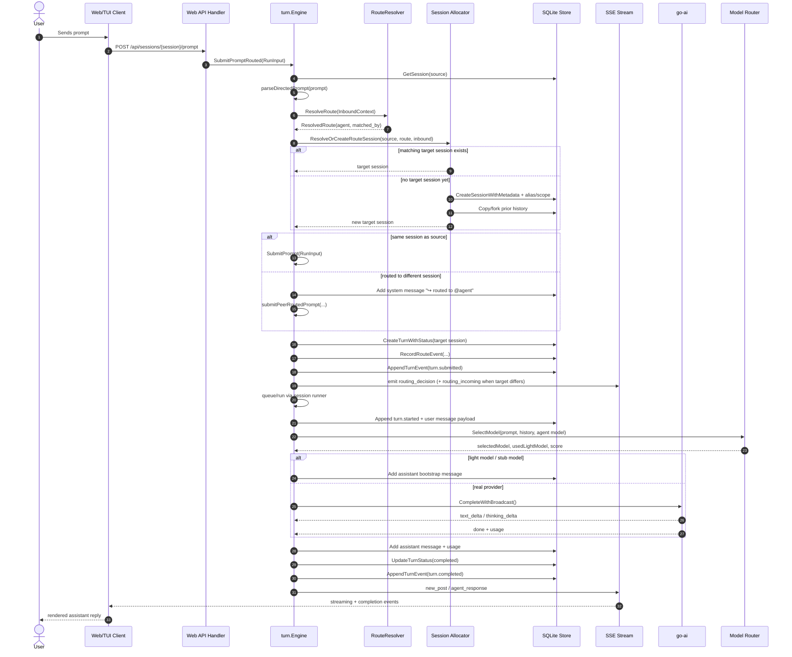
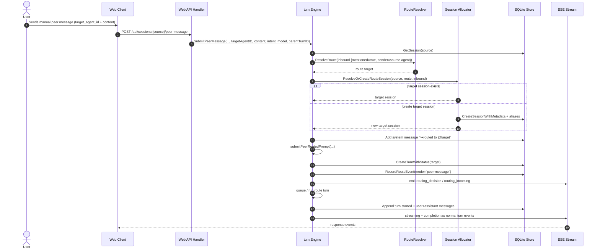
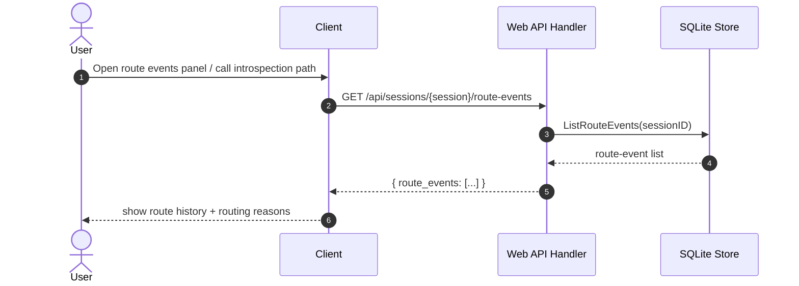
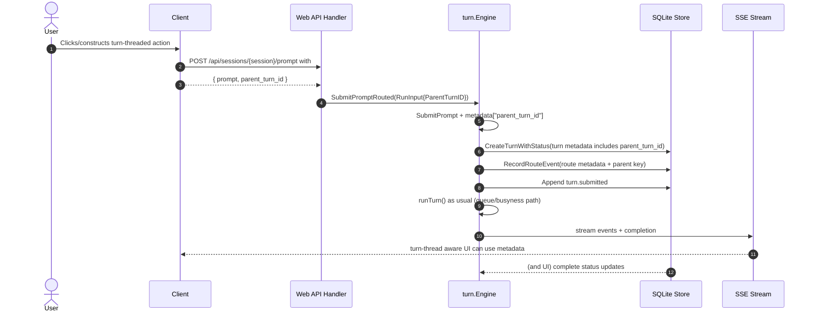

# Routing and route-event introspection

This document tracks Gi's in-process routing layer and how routing decisions are persisted for observability.

It includes mechanism diagrams and concrete sequence flows for prompt, peer-routing, introspection, and parent-turn steering.

## Mechanism overview

```mermaid
flowchart TD
  subgraph Input[Input surfaces]
    WA["Web API: POST /api/sessions/{session}/prompt"]
    WPM["Web API: POST /api/sessions/{session}/peer-message"]
    TC["TUI command /send @agent ..."]
    HE["Inline @mention in user prompt"]
  end

  subgraph Routing[Routing + session resolution]
    SP["parseDirectedPrompt / parse mention"]
    RR["routing.ResolveRoute"]
    AR["Allocate/Resolve target session"]
    CL["session.AllocateRouteSession"]
    SESS["Create or reuse scoped/alias session"]
  end

  subgraph Engine[Turn engine]
    SUB["SubmitPrompt / SubmitPromptRouted / SubmitPeerMessage"]
    TURN["SubmitPrompt (queue + run path)"]
    MUX["Session runner: queued vs immediate"]
    RUN["runTurn"]
    MODEL["modelRouter.SelectModel"]
    INF["go-ai inference stream"]
    RD["Record route event"]
    EVT["turn events + SSE broadcast"]
    MSG["assistant/user messages"]
  end

  subgraph Persistence[SQLite persistence]
    S[sessions]
    T[turns]
    TE[turn_events]
    RE[routing_events]
    M[messages]
  end

  subgraph SSE[/SSE clients/stream/]
    RDEC["routing_decision"]
    RIN["routing_incoming"]
    DEL["agent_draft_delta / thinking_delta"]
    RESP["new_post / agent_response"]
  end

  WA --> SUB
  WPM --> SUB
  TC --> SUB
  HE --> SUB

  SUB --> SP --> RR --> AR --> CL --> SESS
  SESS --> T

  SUB --> TURN --> MUX --> RUN
  RUN --> MODEL --> INF --> EVT --> DEL
  RUN --> MSG --> M
  TURN --> TE
  TURN --> T
  TURN --> RD --> RE
  RD --> EVT

  RE --> EVT --> SSE
  EVT --> SSE
  SSE --> RDEC
  SSE --> RIN
  SSE --> RESP

  SESS --> S
  MSG --> M
```

---

## Prompt routing sequence (with user prompt)



---

## Peer message routing sequence (`/api/sessions/{session}/peer-message`)



---

## Route-event introspection sequence (`GET /api/sessions/{session}/route-events`)



If you need per-turn details, call normal introspection and inspect embedded metadata:
- `GET /api/sessions/{session}/introspect`
- includes `route_events` and `route_event_count`

---

## Parent-turn steering sequence (`parent_turn_id`)

Parent-turn threading allows UI callers to pass the parent relation when creating follow-up routed prompts.



## API surface

- `GET /api/sessions/{session_id}/route-events`
  - returns `{ "route_events": [ ... ] }`
- `GET /api/sessions/{session_id}/introspect`
  - now includes:
    - `route_events`
    - `route_event_count`

## Config input

Runtime config consumed by routing:
- `agents`: known agents + per-agent model override
- `session.dimensions`: session namespace dimensions used by scope allocation
- `routing`: model-routing thresholds + route selector settings

These values are loaded from runtime configuration:
- `/.pi/settings.json`
- `config.RuntimeConfig`

## SSE events

The engine publishes non-fatal, best-effort routing observability events:
- `routing_decision`
- `routing_incoming`

Both events are sent as SSE payloads with routing context including:
- `chat_jid` (`gi:{session_id}`)
- `turn_id`
- `source_session`
- `target_session`
- `source_agent_id`
- `target_agent_id`
- `mode`
- `matched_by` (decision-only event)

## Route-event persistence (`routing_events`)

Columns tracked:
- `id`
- `turn_id` (nullable)
- `source_session_id`
- `target_session_id` (nullable)
- `source_agent_id`
- `target_agent_id`
- `mode` (`prompt`, `peer-message`)
- `matched_by`
- `routing_policy`
- `requested_agent_id`
- `metadata_json`
- `created_at`

## Recovery / DB-first semantics

Routing never bypasses the normal queue/cancel/recovery path. Route decisions are persisted before execution starts so each routing action is durable even if inference is cancelled or fails.
