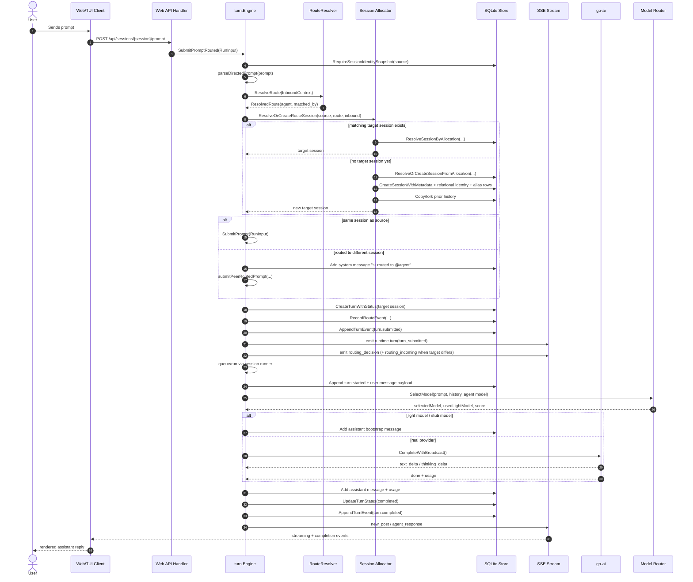
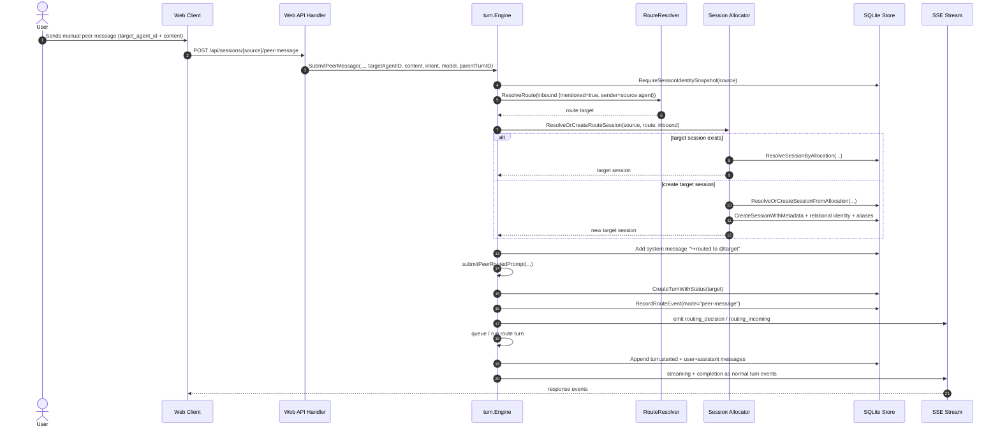
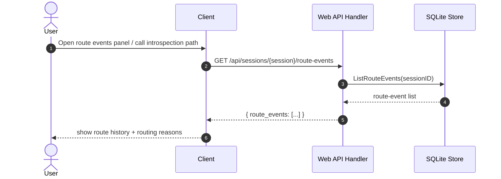
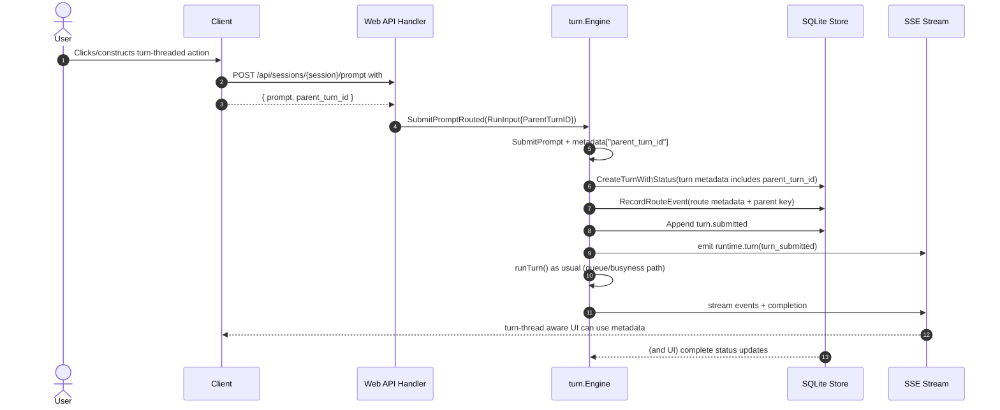

# Routing and route-event introspection

This document tracks Gi's in-process routing layer and how routing decisions are persisted for observability.

It includes mechanism diagrams and concrete sequence flows for prompt, peer-routing, introspection, parent-turn steering, and the current direct/IPC ingress handoff into the same runtime paths.

## Current runtime shape

Route/session resolution now has an explicit orchestration surface inside `internal/turn/`:

- prompt route preparation (`preparePromptRouteResolution`)
- peer route preparation (`preparePeerRouteResolution`)
- target-session resolution (`resolveRoutedPromptTarget`)
- local-route metadata application (`applyLocalRouteMetadata`)
- session-allocation planning (`prepareRouteSessionPlan`)
- existing-session reuse lookup (`resolveExistingRouteSession`)
- clone-on-miss child-session creation (`cloneRouteSession`)

That keeps the submit path aligned with the newer explicit runtime-phase style used elsewhere in turn execution, instead of leaving route/session allocation buried inline inside `SubmitPromptRouted(...)` and `ResolveOrCreateRouteSession(...)`.

The routing path now also depends on store-backed session identity/allocation semantics rather than treating obsolete session-row JSON snapshots as the source of truth. Route/session resolution prefers:

1. canonical opaque session key lookup
2. channel-binding reuse when a bound inbound surface already maps to the same logical session
3. validated alias reuse
4. canonical scope-signature fallback
5. create-on-miss

Two guardrails matter here:

- route-context construction and local routing metadata now use strict canonical identity/snapshot reads, so the engine derives channel/account/source-agent/scoped chat context from relational identity rows and fails closed where a canonical identity row is missing
- route-event recording no longer reloads a full source session row merely to infer `source_agent_id`; it now resolves the source agent directly from `session_identities`, which keeps routing audit rows aligned with canonical identity even when legacy session JSON drifts
- sibling child-session reuse no longer depends on the caller's loaded source row carrying a trustworthy `parent_session_id`; route resolution now asks the store to resolve sibling-child reuse directly from persisted session linkage plus identity tables, and routed local metadata/fork notices likewise derive `source_agent_id` directly from persisted identity by session id
- the routed session planner itself is now source-session-id based rather than source-row based for reuse/fork decisions: same-agent short-circuiting, sibling reuse, peer-routing source metadata, and clone/fork notices all resolve canonical identity/linkage from the store instead of treating a loaded `store.Session` object as the identity carrier through the routing pipeline
- adjacent runtime bootstrap/ingress paths are moving the same way: direct session-key ingress and initial main-session selection now use ID-first store resolution helpers, so they do not materialize whole session rows until later phases actually need session state/history payloads
- allocation matching has now joined that same pattern: opaque-key, channel-binding, alias, and canonical-signature resolution can stay in canonical session-id space until identity validation picks a winner, and only then is the final session row loaded for callers that actually need row payloads
- routed child-session reuse now follows the same rule: child/sibling-child store lookup resolves candidate session ids first, and route resolution only materializes the final winning session row after the parent/agent reuse decision is made
- the surrounding store resolve-or-create paths now mirror that shape internally: allocation matching has a dedicated ID-first finder reused by resolve-or-create flows, continue/main-session branches defer full row reloads until after binding/main-session state changes succeed, and plain session-existence checks inside those flows now use explicit existence helpers instead of loading a whole session row just to prove the id is valid
- alias matches are only accepted when the persisted canonical identity signature still matches the requested routed allocation, so broad compat aliases cannot accidentally collapse distinct routed sessions even if obsolete obsolete session-row JSON snapshots have drifted
- channel-binding reuse is agent-safe: a binding only qualifies if the bound session identity still belongs to the same agent as the incoming allocation
- web `/branch` fork-agent id allocation now follows the same relational-identity bias: used-agent occupancy comes from `session_identities` lightweight map reads (`ListSessionAgentIDs`), source-base fallback uses strict canonical runtime identity with explicit UI defaulting only at presentation edges, and helper normalization/candidate selection is deterministic and regression-tested instead of depending on stale obsolete session-row JSON snapshots

## Mechanism overview

```mermaid
flowchart TD
  subgraph Input[Input surfaces]
    WA["Web API: POST /api/sessions/{session}/prompt"]
    WPM["Web API: POST /api/sessions/{session}/peer-message"]
    TC["TUI command /send @agent ..."]
    HE["Inline @mention in user prompt"]
    DI["Direct/IPC envelope: ProcessDirect(...)"]
  end

  subgraph Routing[Routing + session resolution]
    SP["parseDirectedPrompt / parse mention"]
    RR["routing.ResolveRoute"]
    AR["Allocate/Resolve target session"]
    CL["session.AllocateRouteSession"]
    SESS["Create or reuse scoped/alias session"]
  end

  subgraph Engine[Turn engine]
    SUB["SubmitPrompt / SubmitPromptRouted / SubmitPeerMessage"]
    TURN["SubmitPrompt (queue + run path)"]
    MUX["Session runner: queued vs immediate"]
    RUN["runTurn"]
    MODEL["modelRouter.SelectModel"]
    INF["go-ai inference stream"]
    RD["Record route event"]
    EVT["turn events + SSE broadcast"]
    MSG["assistant/user messages"]
  end

  subgraph Persistence[SQLite persistence]
    S[sessions]
    T[turns]
    TE[turn_events]
    RE[routing_events]
    M[messages]
  end

  subgraph SSE[/SSE clients/stream/]
    RDEC["routing_decision"]
    RIN["routing_incoming"]
    DEL["agent_draft_delta / thinking_delta"]
    RESP["new_post / agent_response"]
  end

  WA --> SUB
  WPM --> SUB
  TC --> SUB
  HE --> SUB
  DI --> SUB

  SUB --> SP --> RR --> AR --> CL --> SESS
  SESS --> T

  SUB --> TURN --> MUX --> RUN
  RUN --> MODEL --> INF --> EVT --> DEL
  RUN --> MSG --> M
  TURN --> TE
  TURN --> T
  TURN --> RD --> RE
  RD --> EVT

  RE --> EVT --> SSE
  EVT --> SSE
  SSE --> RDEC
  SSE --> RIN
  SSE --> RESP

  SESS --> S
  MSG --> M
```

---

## Prompt routing sequence (with user prompt)



---

## Peer message routing sequence (`/api/sessions/{session}/peer-message`)



---

## Route-event introspection sequence (`GET /api/sessions/{session}/route-events`)



If you need per-turn details, call normal introspection and inspect embedded metadata:
- `GET /api/sessions/{session}/introspect`
- includes `route_events` and `route_event_count`

---

## Parent-turn steering sequence (`parent_turn_id`)

Parent-turn threading allows UI callers to pass the parent relation when creating follow-up routed prompts.



## API surface

- `GET /api/sessions/{session_id}/route-events`
  - returns `{ "route_events": [ ... ] }`
- `GET /api/sessions/{session_id}/introspect`
  - now includes:
    - `route_events`
    - `route_event_count`

## Config input

Runtime config consumed by routing:
- `agents`: known agents + per-agent model override
- `session.dimensions`: session namespace dimensions used by scope allocation
- `routing`: model-routing thresholds + route selector settings

These values are loaded from runtime configuration:
- `/.pi/settings.json`
- `config.RuntimeConfig`

## SSE events

The engine publishes non-fatal, best-effort routing observability events:
- `routing_decision`
- `routing_incoming`

Both events are sent as SSE payloads with routing context including:
- `chat_jid` (`gi:{session_id}`)
- `turn_id`
- `source_session`
- `target_session`
- `source_agent_id`
- `target_agent_id`
- `mode`
- `matched_by` (decision-only event)

## Route-event persistence (`routing_events`)

Columns tracked:
- `id`
- `turn_id` (nullable)
- `source_session_id`
- `target_session_id` (nullable)
- `source_agent_id`
- `target_agent_id`
- `mode` (`prompt`, `peer-message`)
- `matched_by`
- `routing_policy`
- `requested_agent_id`
- `metadata_json`
- `created_at`

## Direct/IPC ingress handoff

The first direct-processing slice now uses a normalized engine-facing envelope:

- `DirectInput`
- `DirectOrigin`
- `Engine.ProcessDirect(...)`
- `Engine.ProcessSystemDirect(...)`
- `Engine.ProcessInternalDirect(...)`

Current behavior:

- direct prompt ingress reuses `SubmitPromptRouted(...)`
- direct peer-message ingress reuses the routed peer-message path
- direct continue ingress reuses `ContinueSession(...)`
- direct/session-key resolution and those downstream routed prompt / peer-message / continue actions now fall back to engine-owned durable context when the caller context is already canceled, so direct/IPC/system ingress still reaches the normal runtime path instead of failing before session-key resolution or downstream submission
- direct ingress may target a session by explicit `SessionID` or by explicit `SessionKey`, with session-key resolution flowing through the same canonical store lookup path used elsewhere; if both are supplied they must agree, otherwise the request is rejected as ambiguous
- explicit system/internal entrypoints default the origin kind/role instead of relying on callers to pass those values ad hoc
- same-session direct/system follow-up input while a turn is active reuses the steering path instead of spawning a competing queued turn
- routed direct prompts still flow through the normal route/session-resolution path and carry ingress metadata forward onto the resulting target turn
- direct-origin turns stamp normalized ingress audit metadata onto turn metadata, persisted user-message payloads, and `turn.started` event payloads (`ingress_kind`, `ingress_source_kind`, `ingress_source_id`, `ingress_role`, `ingress_label`, `ingress_session_key` when provided); the current implementation now keeps the explicit session-key variant aligned across all three persisted audit surfaces instead of only on turn metadata
- callers can now also enqueue the same normalized direct envelopes into the durable `inbound_work_queue` and drain them through `Engine.ProcessNextInboundWork(...)` / `Engine.ProcessQueuedInboundWork(...)`, which feed back into the same `ProcessDirect(...)` runtime path rather than bypassing routing/session/steering semantics
- the guarded web runtime layer now exposes that narrow path via `/api/runtime/inbound-work`, `/api/runtime/inbound-work/drain`, `/api/runtime/inbound-work/requeue`, and `/api/runtime/inbound-work/discard`, giving the queue a real runtime ingress/worker-style caller; the list route now also reports per-status counts and supports `eligible=true|false` so callers can distinguish runnable work from retry/backoff rows, while the requeue/discard routes give bounded manual recovery controls without bypassing the normal runtime path or deleting queue audit rows
- the main web runtime now also runs a small configurable background dispatcher that drains bounded queued batches through the same engine path, so queued direct/IPC/system work no longer depends solely on manual drain calls
- when multiple web runtimes share the same SQLite store, dispatcher ownership is now coordinated via a store-backed lease so only the current lease holder performs automatic inbound draining at a time
- inbound queue row lifecycle (`enqueue`, retry/failure/completion, manual requeue/discard) and dispatcher lease/drain notices now publish through the canonical topic bus as `runtime.inbound_work` and `runtime.dispatcher`
- web consumers can now subscribe to canonical topic-bus streams directly via `/sse/topics?topic=<pattern>` with optional `session_id` / `agent_id` scoping, so newer runtime families do not need ad hoc SSE wiring just to become observable
- inbound queue rows now track retry metadata (`attempt_count`, `last_error`, `next_attempt_at`), and retrying items are deferred until eligible again rather than being retried in a tight loop
- the dispatcher continues past retrying/failed items in the same sweep, so one bad queued envelope does not block later eligible work from reaching the normal routing/session/turn path

This is now a narrow durable inbound-queue path, not just an envelope-only entrypoint; what remains pending is broader dispatcher policy and multi-worker orchestration above those engine/store primitives.

## Session allocation semantics used by routing

The current routing/session allocation stack assumes:

- routed/default allocation produces a canonical scope plus opaque session key and compat aliases
- `identity_links` canonicalization happens again at the store boundary, not only at route-preparation time
- explicit caller-supplied opaque allocation keys are preserved when they are already canonical/valid
- default/main-session flows can prefer a stored main session for the `(agent, channel, account)` tuple instead of relying only on recency
- explicit cross-channel continuation can reuse an existing session via `ContinueSessionID`, after which future allocations on that bound inbound surface may resolve back through `session_channel_bindings`

Current explicit-vs-automatic linking policy:

- **explicit linking** means a caller supplies an existing `ContinueSessionID` or a store-backed binding already exists for the inbound channel/account/chat identity; the runtime may then attach/reuse that binding for the same logical session.
- **automatic linking** means the runtime would decide that an unrelated channel/account/chat identity should join an existing session without an explicit continuation or existing binding. That is intentionally not implemented.
- `identity_links` only canonicalize identities inside a routed allocation scope; they do not authorize cross-channel merges by themselves.
- outbound selection remains source-channel/default-surface oriented. The runtime must not automatically fan out a response to every bound channel until a separate outbound policy exists.

What routing does **not** assume yet:

- automatic cross-channel linking between unrelated inbound identities
- automatic outbound fan-out to every bound channel
- richer binding policy beyond explicit continuation plus later bound reuse

## Recovery / DB-first semantics

Routing never bypasses the normal queue/cancel/recovery path. Route decisions are persisted before execution starts so each routing action is durable even if inference is cancelled or fails. Queued/routed turn creation now also emits the canonical `runtime.turn` `turn_submitted` checkpoint so route-triggered queue entry is visible on the same live runtime topic surface as other turn lifecycle edges, not only in stored `turn.submitted` audit rows. The current routing helper layer now also keeps the source-session routing notice, fork notice, and routed-peer downstream submit on the same durable-context footing when the caller context is already canceled, so route-side notices do not land without the corresponding routed action (or vice versa).
